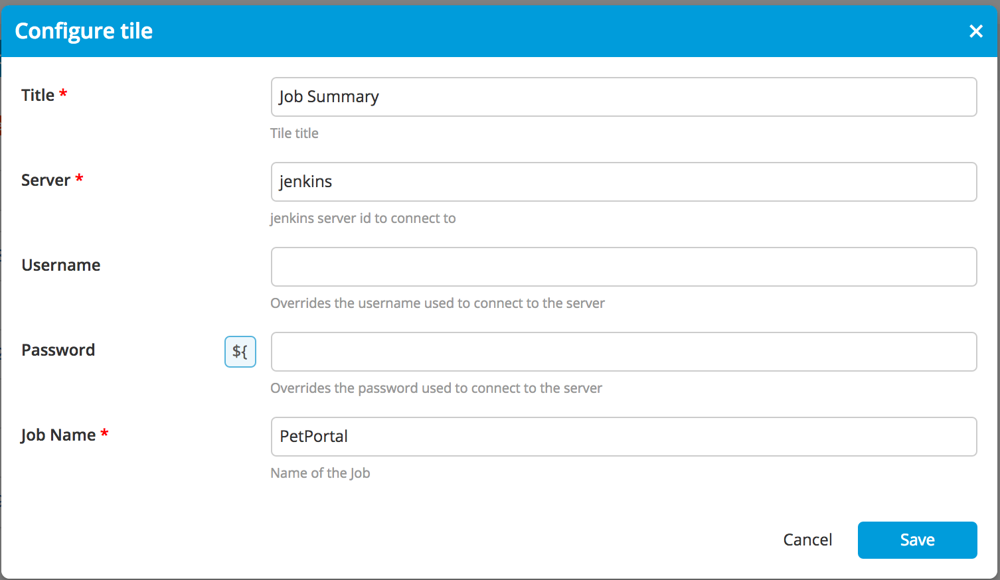
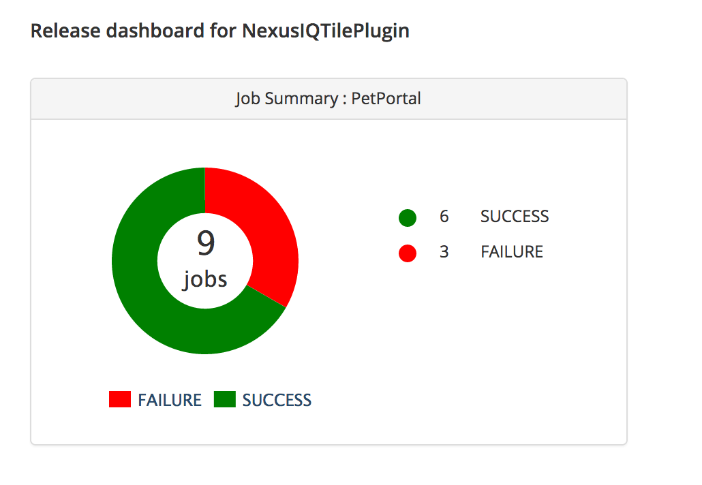
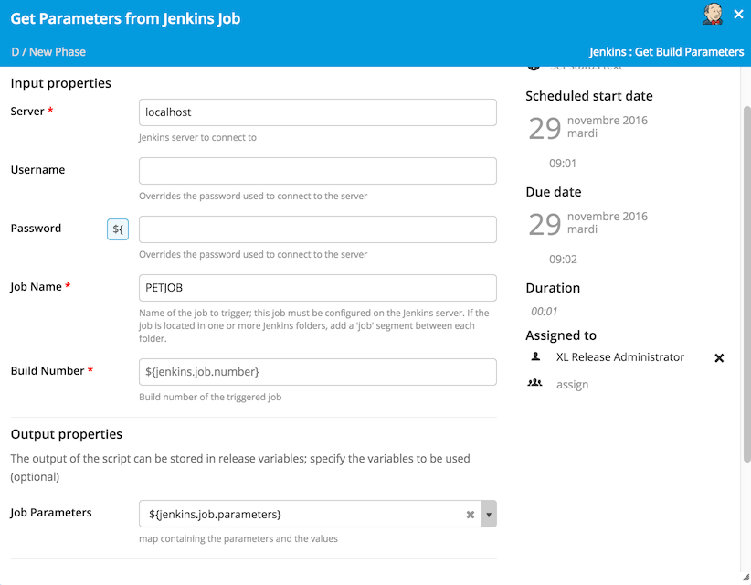
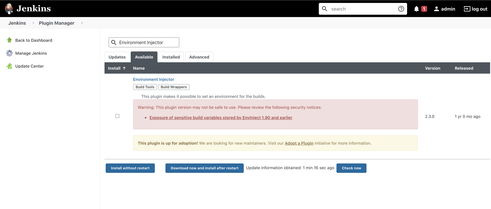
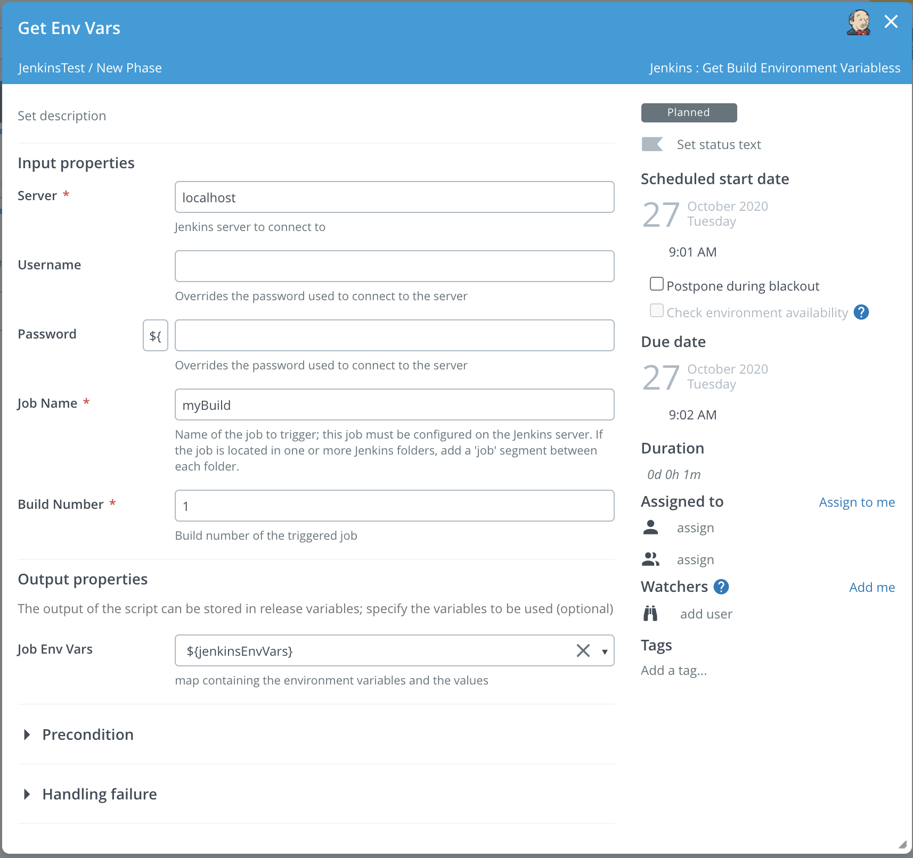

# xlr-jenkins2-plugin

This plugin offers an interface from XL Release to Jenkins 2.x. 

[![Build Status][xlr-jenkins2-plugin-travis-image]][xlr-jenkins2-plugin-travis-url]
[![Codacy Badge][xlr-jenkins2-plugin-codacy-image] ][xlr-jenkins2-plugin-codacy-url]
[![Code Climate][xlr-jenkins2-plugin-code-climate-image] ][xlr-jenkins2-plugin-code-climate-url]
[![License: MIT][xlr-jenkins2-plugin-license-image] ][xlr-jenkins2-plugin-license-url]
[![Github All Releases][xlr-jenkins2-plugin-downloads-image] ]()


[xlr-jenkins2-plugin-travis-image]: https://travis-ci.org/xebialabs-community/xlr-jenkins2-plugin.svg?branch=master
[xlr-jenkins2-plugin-travis-url]: https://travis-ci.org/xebialabs-community/xlr-jenkins2-plugin
[xlr-jenkins2-plugin-codacy-image]: https://api.codacy.com/project/badge/Grade/a6f64efd62f341acb50f67c511d3fb42
[xlr-jenkins2-plugin-codacy-url]: https://www.codacy.com/app/joris-dewinne/xlr-jenkins2-plugin
[xlr-jenkins2-plugin-code-climate-image]: https://codeclimate.com/github/xebialabs-community/xlr-jenkins2-plugin/badges/gpa.svg
[xlr-jenkins2-plugin-code-climate-url]: https://codeclimate.com/github/xebialabs-community/xlr-jenkins2-plugin
[xlr-jenkins2-plugin-license-image]: https://img.shields.io/badge/License-MIT-yellow.svg
[xlr-jenkins2-plugin-license-url]: https://opensource.org/licenses/MIT
[xlr-jenkins2-plugin-downloads-image]: https://img.shields.io/github/downloads/xebialabs-community/xlr-jenkins2-plugin/total.svg

## Preface

This document describes the functionality provided by the XL Release xlr-jenkins2-trigger-api.

See the [XL Release reference manual](https://docs.xebialabs.com/xl-release) for background information on XL Release and release automation concepts.

This is a 'See It Work' plugin project, meaning the code base includes functionality that makes it easy to spin up and configure a dockerized version of the XebiaLabs platform with this plugin already installed. Using the provided test data, you can then try out the plugin features. This is useful for familiarizing yourself with the plugin functionality, for demonstrations, for testing and for further plugin development. Currently the Demo Data is configured to demonstrate the tasks Get Parameters and Get Environment Variables only.

[See the Demo/Dev section.](#developmentdemo)

## Usage

### Triggers

You can configure a job trigger by first going to your template and selecting `Triggers`. You can use 2 trigger types:

* JobTrigger: Polls for a Jenkins Job to finish
* FolderTrigger: Polls for any Jenkins job(s) to finish underneath a Jenkins folder
  

  
When selected, you can provide the Jenkins details.

 
### Tiles

* **Jenkins Job Summary Tile:**
This tile can be used to pull a summary of all runs of a jenkins job

**Configure Tile**



**Preview Tile**


* **Jenkins Pipeline View Tile:**
This tile breaks down the build time for recent jobs, down to the level of build stages.  Users can quickly identify skipped stages, outlier build times, and build performance degradation.

**The [Pipeline Stage View Jenkins Plugin](https://github.com/jenkinsci/pipeline-stage-view-plugin) must be installed in Jenkins, before using this dashboard tile.**

## Tasks

### Jenkins.GetBuildParameters tasks allows to fetch the parameters from an executed job.

 

### Jenkins.GetEnvironmentVariables task fetchs the environment variables from an executed job.
  
  **NOTE: You must have the [Jenkins plugin ‘Environment Injector’](https://plugins.jenkins.io/envinject/) id=envinject installed prior to executing the Jenkins job**





## Development/Demo

Build and package the plugin with...

```bash
./gradlew clean build
```

### To run demo or dev testbed -

The following will set up a xlr/jenkins testbed using docker. 

1. Clone this github project to your local dev environment
2. You will need to have Docker and Docker Compose installed.
3. You will need to be able to run bash scripts
4. The XL-Release docker image uses the community trial license
5. Build the xlr-jenkins2-plugin.jar - Open a terminal and cd into <xlr-jenkins2-plugin code base> and run ./gradlew clean build . Be sure to re-run the command whenever code is changed.
6. From another terminal, cd into the <xlr-jenkins2-plugin code base>/src/test/resources/docker/  directory.
7. Then run: docker-compose up 
8. XL Release will run on the [localhost port 15516](http://localhost:15516/). It may take up to a minute for XL Release to start up
9. The XL Release username / password is admin / admin
10. Jenkins will run on the [localhost port 9080](http://localhost:9080/). 
11. The Jenkins username / password is admin / admin
12. After XL Release has started, you can set up a template, a shared configuration server in XLR and a test job and build in Jenkins by running the script <xlr-jenkins2-plugin code base>/src/test/resources/docker/initialize/initialize_data.sh.
13. You can then run a release within XLR using the template named 'jenkingTest'.
14. When code is modified, re-run the ./gradlew clean build (in the first terminal), then refresh the testbed by running docker-compose down (in a third terminal) followed by docker-compose up (in the second terminal). After XL Release starts up, re-run <xlr-jenkins2-plugin code base>/src/test/resources/docker/initialize/initialize_data.sh.

Further Demo/Dev Notes:

1. The log file for the plugin - plugin.log will be persisted to the local directory <xlr-jenkins2-plugin code base>/build/reports/tests/log directory.

## Contributing

Please review the contributing guidelines for _xebialabs-community_ at [http://xebialabs-community.github.io/](http://xebialabs-community.github.io/)

## License

This community plugin is licensed under the [MIT license][xlr-jenkins2-plugin-license-url].

See license in [License.md](License.md)